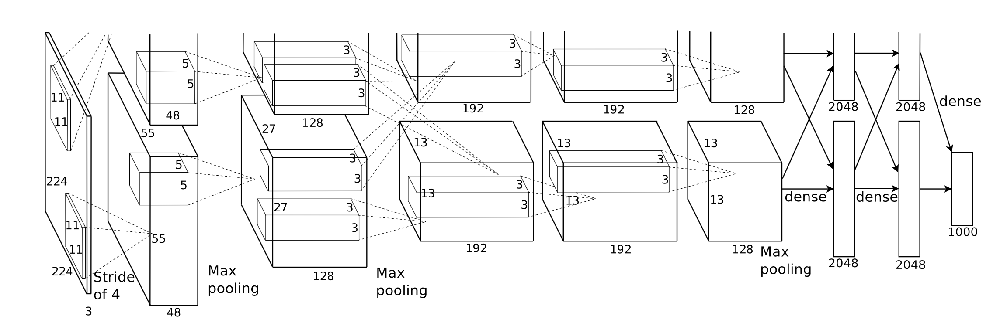

#CORGY - A Neural Network Framework Parallelized by Metal 2

By [Buqian Zheng](https://github.com/zhengbuqian)(buqianz) and [Yongkang Huang](https://github.com/MrDwZ)(yongkan1)

We are going to implement a set of a library to build neural network parallelized by Metal 2 so we can efficiently run the inference stage of the prevalent NN models trained by major machine learning frameworks on iOS and macOS devices.

## Background

Metal 2 framework is an interface provided by Apple that provides near-direct access to the graphics processing unit (GPU) on iPhone/iPad and Mac. Besides graphics, Metal 2 incorporated a bunch of libraries that provide excellent paralyzed support to the necessary linear algebra operations and signal processing functions that capable of running in various kind of Apple devices. These libraries made it's possible for us to build a well implemented GPU-accelerated deep learning models on the iOS devices based on the trained model given by other frameworks.[1](#f1) 

Generally speaking, the _inference_ stage of a trained neural network is very computation intensive, especially for those models that have a considerably large number of layers or applied in the scenarios that are necessary to process high-resolution images.  It's worth notice that there is a **tremendous amount of matrix computation** which is appropriate to apply parallelized operation to optimize the performance.

A sample Neural Network(AlexNet) with multiple layers[2](#f2)

## The Challenge

**What are the dependencies**

The neural network receives data dependencies between different kind of layers. Usually, the deep neural network that widely accepted today consists of a considerably large number of layers and each of them has a different kind of workloads. For instance, for the convolutional neural network(CNN), the major building block incorporating the convolution layer, which's major workload is to executes the matrix dot product between the convolution kernel and the image in the layer; the pooling layer which performs  the extraction of the max value or the average value of the pixel in the given region, the major workload of fully connected layer is to perform tremendous amount of matrix multiplications and activate function computations.

**What are its memory access characteristics?**
The memory access characteristics of the neural network are decided by how specifically we present the data model and the strategies to dynamically load the weight from permanent storage. Generally speaking, the convolution and pooling operation requires a square region of the image presentation, if we store the image in a row major manner, for large images the locality is not ideal due to that the different row of the image is not stored in the consecutive region of virtual memories.

In addition to the image representation storage, the storage of the weight connect each layer is also crucial to the performance. Basically, we want the weight representation stored in the permanent storage to be compact, especially for the mobile devices that are sensitive to the storage capacity constraints. Also, when doing a batch of calculations, we want the expanded weights in memory not only to have the good locality but also friendly to the cache coherence policy of both the X86 and ARM platform to gain expected outstanding performance.

**Is there a high communication to computation ratio?**
The computation is actually based on a shared memory model that we do not require multiple devices to execute the trained model, so the computation intensity should be high and the communication to computation ratio should be relatively low. The exact complexity will be calculated after we have done the implementation.

**What are the properties of the system that make mapping the workload to it challenging?**
As the matter of fact, due to the fact that various of the Apple products that across both x86 and ARM structures and the difference of architectures as well as the supported technologies and number of processing units of the different generations of the same kind of product. It could be tough to have a general rule to fine tune the performance that is commonly accepted by all the platforms.

## Resources
This project will be implemented from scratch. We'll be using iPhone, iPad and MacBook Pro as the platform on which the framework will run. However we will perhaps reference source code of PyTorch[3](#f3) and Caffe[4](#f4) framework about the implementation of a Neural Framework.

The CPU accelerated part of the library will majorly base on Basic Linear Algebra Subprograms(BLAS) in the Accelerate library and the GPU version will be based on Metal Performance Shaders library of Metal 2. We are not going to utilize the modules in both libraries that directly related to our project in the implementation and some of them might be used for the benchmarking.

## Goals and Deliverables

### Plan to achieve

Our goal in this project is to implement a parallel Neural Network framework that runs on Apple's devices with iOS and macOS. We will explore the parallel ability of the GPU and CPU on the variety of devices that support both the Accelerate library and Metal 2. Due to the limitation of power and computation resources of mobile devices, this framework will mainly focus on the inference stage of a trained neural network, which is the major use case for those devices.

We want to achieve the following goals:

1. Simplify the process of migrating general neural network model trained by mainstream open-source machine learning frameworks such as MyTouch and Keras to iOS and macOS devices.
2. Leveraging the power of the GPU and CPU computing resources of iOS and macOS devices;
3. Make the inference imported neural network mobile-friendly, such as apply the compressed model to reduce application package size.

This framework will add support for common layers such as `fully connected`, `ReLU`, `Dense`, `MaxPooling`, `AveragePooling`,`Convolution`, `SoftMax` layers.

We will make a demo application that runs on iPhone as the host app of a popular trained neural network model Tiny YOLO to do object recognition. We hope that we can process 5 to 10 images captured by the camera on iPhone which is almost real-time.

## Platform Choice

We will choose iOS and macOS as host OS. Metal 2 frameworks and Accelerate framework will be used to implement our framework. We will choose Swift as our primary language. The specifically related hardware platform currently decided to incorporate:

ARM:

* iPhone 6s
  * Processor: Apple A9 (2 Cores CPU with ARMv8-A Architecture and 6 cores GPU)
  * 2 GB LPDDR4 RAM
* iPad Air
  * Processor: Apple A7 (2 Cores CPU with ARMv8-A Architecture and 4 cores GPU)
  * 2 GB LPDDR4 RAM

X86:

* MacBook Pro
  * Intel Iris Graphics 6100 1536 MB
  * Intel Core i5-5257U CPU (2 cores with hyper-threading)
  * 8GB DDR3 RAM
* MacBook Air
  * Intel HD Graphics 5000 1536 MB
  * Intel Core i5-4250U CPU (2 cores with hyper-threading)
  * 4GB DDR3 RAM

## Schedule

Checkpoint 1: April 18, Checkpoint 1: April 27, Due: May 7

|Time|Task|Status|
|---|---|---|
|Project checkpoint I|Implement the BLAS based version of GPU based version and done the related benchmark ||
|Project checkpoint II|Implement finely tuned implementation based on MPS and complete benchmark||
|Before Due|Implement a demo object detection application and the thorough benchmarks according to multiple devices ||

### References

<b id="f1">1</b> https://developer.apple.com/metal/ [↩](#a1)

<b id="f2">2</b> https://papers.nips.cc/paper/4824-imagenet-classification-with-deep-convolutional-neural-networks.pdf [↩](#a2)

<b id="f3">3</b> http://pytorch.org [↩](#a3)

<b id="f4">4</b> https://github.com/BVLC/caffe [↩](#a4)
