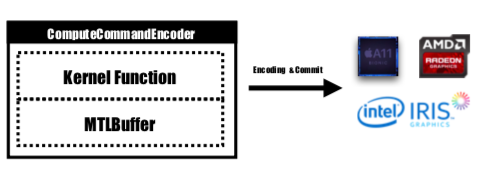
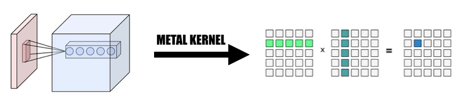

# Corgy - A Neural Network Framework for macOS and iOS parallelized by Metal

By [Buqian Zheng](https://github.com/zhengbuqian)(buqianz) and [Yongkang Huang](https://github.com/MrDwZ)(yongkan1)

We implemented Corgy, a neural network framework in Swift and Metal. Corgy can be embedded into both macOS and iOS applications and be used to construct trained neural networks and evaluate them with ease. We achieved 60x to 150x speedup on different devices with different GPUs.

## Background

Metal 2 framework is an interface provided by Apple that provides near-direct access to the graphics processing unit (GPU) on iPhone/iPad and Mac. Besides graphics, Metal 2 incorporated a bunch of libraries that provide excellent parallelize support to the necessary linear algebra operations and signal processing functions that capable of running in various kind of Apple devices. These libraries made it possible for us to build a well implemented GPU-accelerated deep learning models on the iOS devices based on the trained model given by other frameworks.[1](#f1) 

Generally speaking, the _inference_ stage of a trained neural network is very computation intensive, especially for those models that have a considerably large number of layers or applied in the scenarios that are necessary to process high-resolution images.  It's worth notice that there is a **tremendous amount of matrix computation(eg. convolution)** which is appropriate to apply parallelized operation to optimize the performance.

*

A sample Neural Network(AlexNet) with multiple layers[2](#f2)

*

### Challenges

#### Usability
The first challenge we confronted is to design a good abstraction of application programming interface that is expressive, easy to use with the low learning curve that is easy to use to our users.

During the entire development process, we tried the best effort to keep the public API as simple as possible, while with all necessary properties to create every component demanded by leveraging the functional programming mechanism provided by Swift. We also deliberately hid unnecessary hardware abstraction provided by Metal to smooth the learning curve.

Though the trained model of the various network is easy to obtain on the Internet, the heterogeneousness among them that caused by different implementation applying various kind of tools inured the work to create a universal model importer.

#### Computing
Some of the computation is easy to understand by its conception but requires attentive thought when you want to create an effective implementation by abstracting it. Convolution is a representative example.

The intrinsic property of the convolution operation does not have a good locality, the vanilla implementation is hard to understand and ineffective with complicated for loops. Also, we need to consider the abstraction provided by Metal 2 and create a convenient way to share necessary information and data structures between host and device with careful consideration of data representation and memory layout.

#### Cross-Platform
During the development phase, we are conscientious when dealing with the ability for our code that runs normally on macOS and iOS with no compromise in performance on both platforms. We tried the best effort to maintain the code library that is capable to compile and execute in both platforms. We are cautious to maximize the code shared between the different target and reusing the code as much as possible.

#### Debugging
Since a fully implemented component of the neural network layer should provide support with the reasonable amount of parameters that make the component enough usable, the complexity of the components is actually quite impressive. For instance, the convolution layer should support the parameters incorporating padding, dilation stride etc and all of them should be cautiously considered when doing the parallelization that achieves reasonable performance. We constructed some simple networks to do the regression test. Test cases are created in other frameworks (Primarily PyTorch and Keras) to make sure that all the implementation works correctly.

#### Immature Programming Language Ecosystem
Swift was first developed in July 2010 and published and open sourced in 2014. Though it's been almost 4 years since it's publication, the lack of the impactful library is still an unignorable problem. Some reason caused this situation, the dominant role of Apple and the fast iterative natural of Swift might be the reason for this phenomenon. Some library that is crucial for us is either not powerful or functional enough to our needs, or nor well-maintained by the individual developer that invent them. We spent quite a lot of time to implement a well-functioned tensor class for our demands.

Also, this is another reason to hinder the development of a universal model parser that the file and string handling function have very limit capability.

In addition, the development and debugging tools are basically restricted to Xcode, though there are other choices that more general for us, Xcode is still the de facto standard tool for our development.

#### Performance Tuning
For the performance tuning for the mobile devices, Apple does not provide detailed hardware specification for their SoC, marketing name is widely used by media and it's hard to deduce what's the exact impact of a specific hardware feature and fine-tuning the performance of the implementation.

## Approach

We are using Swift programming language, specifically, Swift 4.2 which is the latest so far; Metal 2 framework and some library functions provided by Metal Performance Shader (Basically Linear Algebra Functions). Tough Apple launched CoreML SDK  in Spring 2017 that incorporated some support for convolution neural network, we are not using them in Corgy to gain the invaluable experience in developing parallelized implementation of the network layers and provide succinct and intuitive API's with good usability and smooth learning curve for the users to migrate a model from other frameworks effortlessly.

Our target machines are all devices running macOS and iOS, such as iMac, MacBook, iPhone, and iPad. Specifically, the device with the platform that supports MPS linear algebra library (i.e. after iOS 10.0 and macOS 10.13), which means that the iPhone launched after iPhone 5, the iPad launched after iPad (4th gen), and iPod Touch (6th gen) are supported as the iOS platform. The Mac product line gets even wider coverage, including iMac produced after late 2009 or newer, all the MacBook Series launched after mid-2010 and iMac Pro.

The parallel abstraction of Metal 2 is very much alike CUDA: when dispatching computer pass to GPU, programmers will first write kernel functions that will be executed by each thread, then specify the number of thread group(aka. block in CUDA) in grid and number of threads in each thread group, Metal will execute kernels over this grid, the kernel is implemented in a C++14 accent named Metal shading language. Inside each thread group, there is the smaller unit called SIMD group, means a bunch of threads that share same SIMD instructions. But under our implementation, there is no need to consider this.

Metal provides a protocol named commandBuffer which stores encoded commands that are committed and executed by GPU, everytime we want to launch a task about to performed by GPU, the kernel function would be encoded into GPU instructions, embedded into the Metal shading pipeline, the Metal buffer required to store the data structure that needs to be passed to the device is also be set at this stage, then with specified threadGroups and threadPergroups, the command handled by command buffer would be completely encoded and all set to commit to the device. The GPU will schedule the task and notify the CPU thread which submits the work after the execution is finished.

 
*Metal Graphics Rendering Pipeline [6](#f6)*

*The kernel function would be encoded by `ComputeCommandEncoder` and the task will be created for all the supported platform.*

In our implementation, we widely utilized an intuitive way to map the element into GPU threads: Each element in the output tensor of current layer to one thread: each thread computes and updates exactly one element of the output, and the input will be read-only, so we don't need to worry about synchronization between threads. Under this mapping, threads with continuous ids might read input data from different memory locations but will always write to continuous memory locations. So there won't be scattered operations when writing to memory.

We designed a tensor class as the foundation of all the implementation, we utilized and encapsulated the linear algebra operation into the tensor class instead of writing an additional kernel to deep very dive in the operation that not our primary focus to reduce the complexity of implementation and saving our time to focus on accelerating the network layers.

### Implementations

**1. Change convolution to giant matrix multiplication**

We collect the data from the input data in a parallelized manner to form a giant matrix of both the input variable and the weight. We cache the weight of each convolution layer to avoid recalculation. The padding of the convolution layer would be generated during the parallelization transformation during the calculation, then we invoke the MPSMatrixMultiply to the giant matrix and transform the data from the giant matrix back into the normal tensor class we created.

*
The matrix would be created by kernel functions.
*

**2. The design and implementation of Variable class**

The variable class is the foundation of our implementation as the tensor representation. We encapsulated the MPSMatrixMultiplication for the variable (applied the Unicode multiplication sign (×) to represent it elegantly :-)).

The underlying data structure of the variable is a `UnsafemutableBufferPointer` that points to the data type, we chose the 32-bit Float for simplicity. The `Variable` class maintained two data size, the `actualCount` held the element number that actually stored, the `count` is the size of all the elements the rounded up to the page size of the platform obtained by using `getpagesize()`. 

We maintain these two values to make sure that the `make offer(bytesNoCopy:)` to create the buffer directly on the VM region specified and avoid redundant reallocation which reduce the overhead.

**3. Number of element processed by a single thread**

We tried to map one thread to several elements, from 2 to 16 We tried to map one thread to several elements, from 2 to 16 elements per thread, the performance is almost the same but adds much complexity to our project, so we discarded this approach. per thread, the performance is almost the same, but adds much complexity to our project, so we discarded this approach.

## Result

*All CPU versions mentioned below are naive single-threaded CPU code without SIMD optimization. Compiler optimization at level `-Ofast` is applied.*

We applied iPhone 6s and a 15-inch MacBook Pro as the benchmark platform. The hardware are specified below:

**MacBook Pro(Retina 15-inch, Mid 2015)**

- CPU: Intel Core i7-4770HQ
	- 2.20GHz, 4 cores with Hyper-Threading, 3.4-GHz Turbo Frequency
	-  L2: 256k cache per core, 6M L3 Cache
- 16 GB Memory
	- 2 * 8GB DDR3 1600MHz
- Intel Iris Pro Graphics 5200
	- 	40 Cores, embeded in CPU

	
**iPhone 6S**

- SoC: Apple A9
	- 1.85 GHz, 2 Cores 1.85 dual-core 64-bit ARMv8-A "Twister"
	- Cache : L1 64 KB instruction + 64 KB data, L2: 3MB, L3:4MB
	- GPU: PowerVR Series 7XT GT7600 (six-core)
		- PowerVR Rogue Architecture with 192 FP32 ALU Cores(FP32) and 384(FP16) cores
		- 6 USC
- 	2 GB LPDDR4 RAM

Comparing with the naive CPU version implementation without parallelism, our GPU version is **~60x faster on a mobile device**, **~160x faster on a laptop**.

Experiment network attribute:

MNIST:

- input size: 1 * 28 * 28
- number of weights: ~0.1M
- number of convolution layers: 2
- number of fully connected layer: 1

YOLO:

- input size: 3 * 416 * 416
- number of weights: ~17M
- number of convolution layers: 9
- number of fully connected layer: 0

Measurement result: 

|iPhone 6s|MNIST|Tiny YOLO|
|---|---|---|
|CPU|1500ms|753s|
|GPU|0.025s|0.77s|
|speed up|~60x|~1000x|

|Macbook pro|MNIST|Tiny YOLO|
|---|---|---|
|CPU|626.7|729s|
|GPU|10.01|0.028s|
|speed up|~60x|~26000x|

*Because it takes less time to run GPU version, so we take the average time of 100 runs. The running time of CPU version is the result of running once.*

TODO: how did the program differ when problem size changes?
Based on above benchmark we can see that as the problem size increases,

Why we say our speedup is not good enough? Because when comparing with Apple official implementation of `MPSCNNConvolution`, we are only about one third as fast, which means there is still lots of optimization space. This comparison is based on an open source implementation of YOLO on iPhone using official `MPSCNNConvolution`. This implementation can recognize ~5 images per second while our implementation can only achieve ~1.3 images per second.

And due to a limited time, we weren't able to create a better baseline version and CPU parallelized version to do the benchmark.

What limited your speedup? 

1. An important performance limitation is in the convolution layer. In order to turn convolution computation into matrix multiplication, we need to change the structure of weight matrix. In some last convolution layer of Tiny YOLO, there are nearly 10 million weights and it takes a huge amount of time to rearrange the weight matrix even with GPU acceleration. This should be a memory bound limitation since when applying this rearrangement, each thread only moves one element from one place to another, there is no computation except for find out where this element should go.
**A possible solution: save pre-arrange weights in the file since every time before use weights need to be rearranged.**
TODO: provide data here, how much time exactly this step is causing?

2. In some of the compute kernels, there are `if`s and `for`s which might cause divergence, leading to poor SIMD utilization.

Deeper Analysis: break down of the execution time of the different phase. What phase uses more time? Is there room to improve?

Overall, We believe that our choice of Metal framework to do Neural Network acceleration on iOS and macOS devices is sound, especially for iOS devices. With fewer cores, even with SIMD instructions, a well-tuned CPU version is less likely to get similar performance as GPU version.

## Division of work

Equal work are done by both team members.

## References

<b id="f1">1</b> https://developer.apple.com/metal/ [↩](#a1)

<b id="f2">2</b> https://papers.nips.cc/paper/4824-imagenet-classification-with-deep-convolutional-neural-networks.pdf [↩](#a2)

<b id="f3">3</b> http://pytorch.org [↩](#a3)

<b id="f4">4</b> https://github.com/BVLC/caffe [↩](#a4)

<b id="f5">5</b> https://developer.apple.com/documentation/metal/compute_processing/about_threads_and_threadgroups [↩](#a5)

<b id="f6">6</b> https://developer.apple.com/library/content/documentation/Miscellaneous/Conceptual/MetalProgrammingGuide/Render-Ctx/Render-Ctx.html [↩](#a6)
